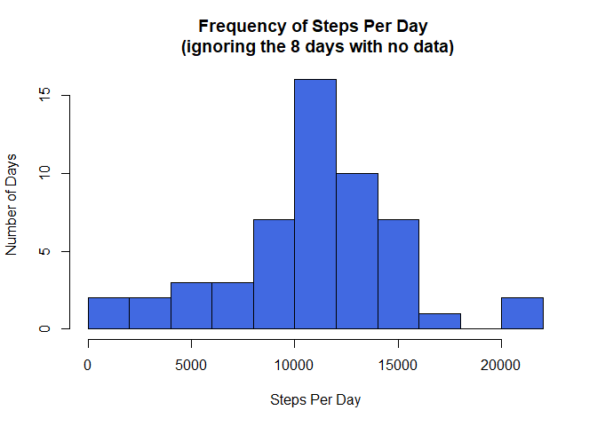
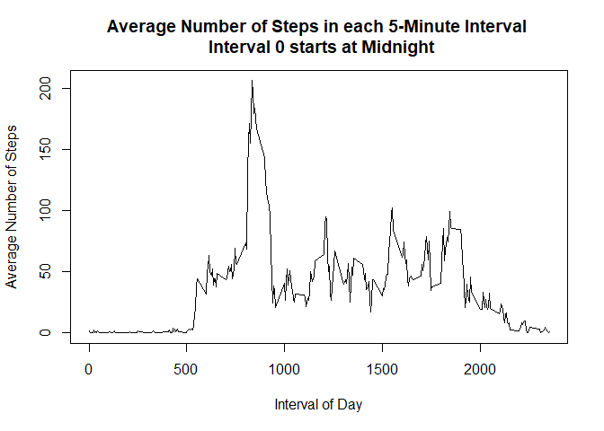
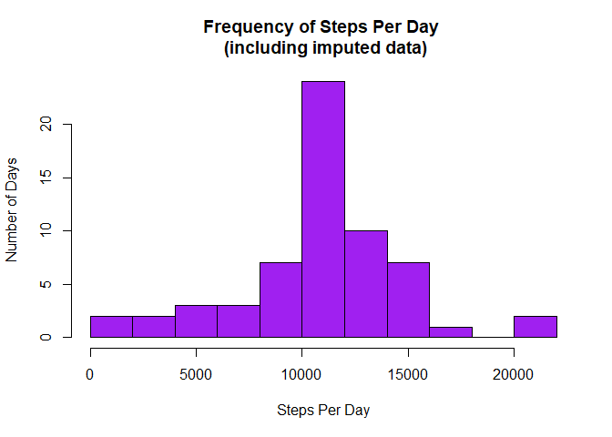
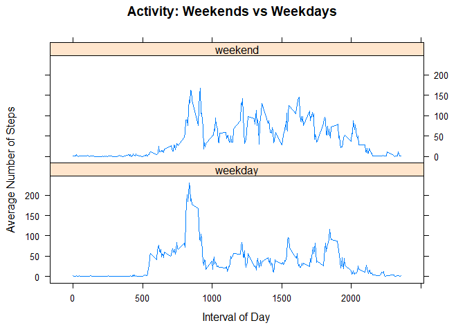

```r
knitr::opts_chunk$set(echo = TRUE)
```

## Loading and preprocessing the data

Check if the file activity.csv is in the working directory.  If not, download and upzip the zip file with activity.csv.  Read in the data and store as a data frame called *data*.


```r
if (!("activity.csv" %in% dir())){
    download.file("https://d396qusza40orc.cloudfront.net/repdata%2Fdata%2Factivity.zip", dest="dataset.zip", mode="wb") 
    unzip ("dataset.zip", exdir = getwd())
}

data <- read.csv("activity.csv", header = T)
head(data)
```

```
##   steps       date interval
## 1    NA 2012-10-01        0
## 2    NA 2012-10-01        5
## 3    NA 2012-10-01       10
## 4    NA 2012-10-01       15
## 5    NA 2012-10-01       20
## 6    NA 2012-10-01       25
```

```r
dim(data)
```

```
## [1] 17568     3
```

## Locate and Analyze NAs


```r
colSums(is.na(data))
```

```
##    steps     date interval 
##     2304        0        0
```

```r
EntriesMissing.count <- colSums(is.na(data))["steps"]
EntriesMissing.count
```

```
## steps 
##  2304
```

```r
MissingDates <- unique(data$date[is.na(data$steps)])
MissingDates
```

```
## [1] 2012-10-01 2012-10-08 2012-11-01 2012-11-04 2012-11-09 2012-11-10
## [7] 2012-11-14 2012-11-30
## 61 Levels: 2012-10-01 2012-10-02 2012-10-03 2012-10-04 ... 2012-11-30
```

```r
length(MissingDates)
```

```
## [1] 8
```

There are 2304 NAs in the data, all in the *steps* column.  
There are 8 dates for which some data are missing.  
Since each interval lasts 5 minutes, there are 12 intervals per hour for a total of 288 intervals per day.  
The dates with missing data have a total of 2304 intervals, which is the same as the number of missing data values!      

**Conclusion: For any given date, either ALL the data are missing or NONE of the data is missing.**     

There are 8 dates with NO step data and 53 dates with COMPLETE step data.

## What is mean total number of steps taken per day?

Dates with missing steps data are assigned NA for total number of steps. These dates have NO step data.


```r
StepsByDay <- tapply(data$steps, data$date, sum)
MeanStepsPerDay <- round(mean(StepsByDay, na.rm = TRUE), digits = 2)
MedianStepsPerDay <- median(StepsByDay, na.rm = TRUE)
MeanStepsPerDay; MedianStepsPerDay
```

```
## [1] 10766.19
```

```
## [1] 10765
```

For the 53 days with steps data, the mean is 10766.19 steps per day and the median is 10765 steps per day.  The 8 days with no data are not included in this mean and median.   

##Histogram of Total Number of Steps Taken Each Day

The histogram shows the distribution of steps per day for the 53 days with steps data, ignoring the 8 days with no data.  


```r
hist(StepsByDay, col = "royalblue", breaks = 10, xlab = "Steps Per Day",
     ylab = "Number of Days", main = "Frequency of Steps Per Day \n (ignoring the 8 days with no data)")    
```

<!-- -->

## What is the average daily activity pattern?


```r
AvgStepsByInterval <- tapply(data$steps, data$interval, mean, na.rm = TRUE)
plot(names(AvgStepsByInterval), AvgStepsByInterval, type = "l",
     xlab = "Interval of Day", ylab = "Average Number of Steps",
     main = "Average Number of Steps in each 5-Minute Interval \n Interval 0 starts at Midnight") 
```

<!-- -->

```r
MaxAvgStepsByInterval <- AvgStepsByInterval[which(AvgStepsByInterval == max(AvgStepsByInterval, na.rm = TRUE))]
MaxAvgStepsByInterval <- round(MaxAvgStepsByInterval, 1)
MaxAvgStepsByInterval
```

```
##   835 
## 206.2
```

```r
MaxInterval <- names(MaxAvgStepsByInterval)
MaxInterval
```

```
## [1] "835"
```

The maximum is 206.2 steps per interval during the interval starting at time 0835.

## Imputing missing values

We will impute missing data by replacing each NA with the mean of the number of steps in the same interval for days with data.


```r
data.extended <- data
for (i in unique(data.extended$interval)){
    data.extended[is.na(data.extended$steps) & data.extended$interval == i, "steps"] <- 
        AvgStepsByInterval[as.character(i)]
}

StepsByDay.extended <- tapply(data.extended$steps, data.extended$date, sum)
hist(StepsByDay.extended, col = "purple", breaks = 10, xlab = "Steps Per Day",
     ylab = "Number of Days", main = "Frequency of Steps Per Day \n (including imputed data)")    
```

<!-- -->

```r
MeanStepsPerDay.extended <- round(mean(StepsByDay.extended), digits = 2)
MedianStepsPerDay.extended <- round(median(StepsByDay.extended), digits = 2)
MeanStepsPerDay.extended; MedianStepsPerDay.extended
```

```
## [1] 10766.19
```

```
## [1] 10766.19
```

After imputing missing values, the mean is 10766.19 steps per day and the median is 10766.19 steps per day.  

Since imputing filled in missing data for entire days with averages, the mean steps per day is unchanged.  Since the mean and median were originally so close, adding 8 pulls the median so it is now equal to the mean.  The histogram is very similar except that the highest bar is much higher than before, showing that the imputed data added more days with the average number of steps.

## Are there differences in activity patterns between weekdays and weekends?


```r
IsWeekend <- weekdays(as.Date(data.extended$date, "%Y-%m-%d")) %in% c("Sunday", "Saturday")

data.extended$DayType[IsWeekend] <- "weekend"
data.extended$DayType[!IsWeekend] <- "weekday" 

AvgStepsByInterval.extended <- aggregate(data.extended$steps, 
                                         by = list(data.extended$interval, data.extended$DayType), FUN = mean)
names(AvgStepsByInterval.extended) <- c("interval", "DayType", "AvgSteps")

library(lattice)
with(AvgStepsByInterval.extended, xyplot(AvgSteps ~ interval | DayType, type = "l", layout = c(1,2),
                                         xlab = "Interval of Day", ylab = "Average Number of Steps",
                                         main = "Activity: Weekends vs Weekdays"))
```

<!-- -->

